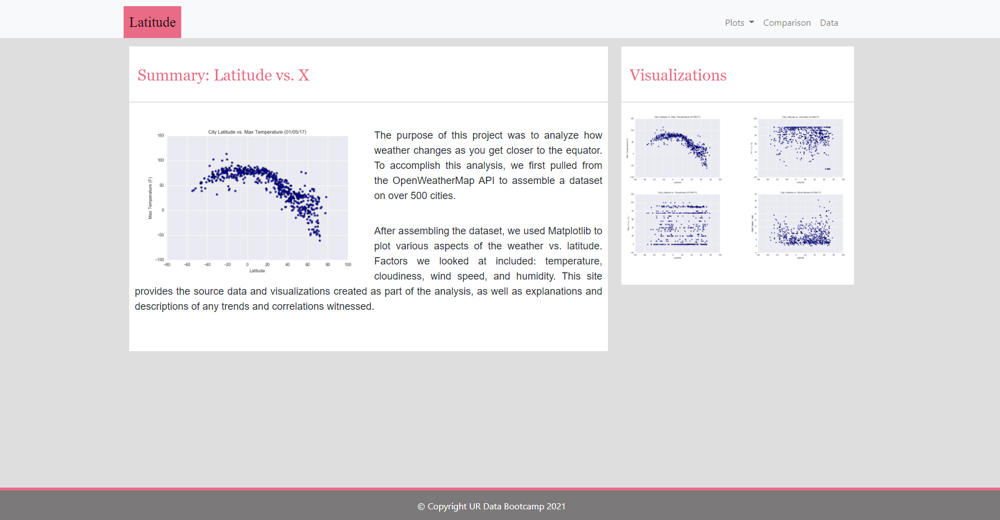
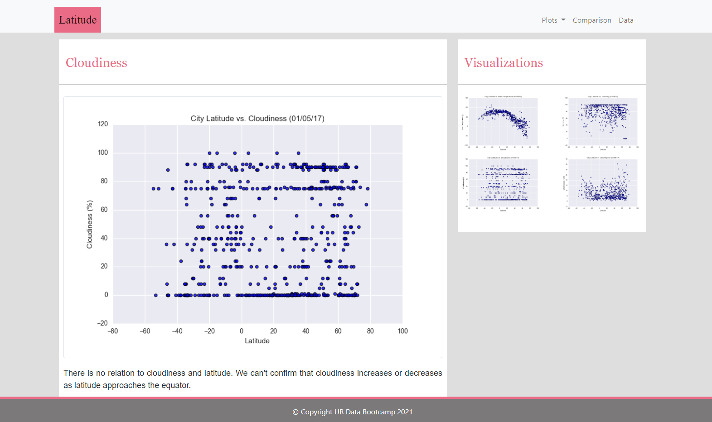
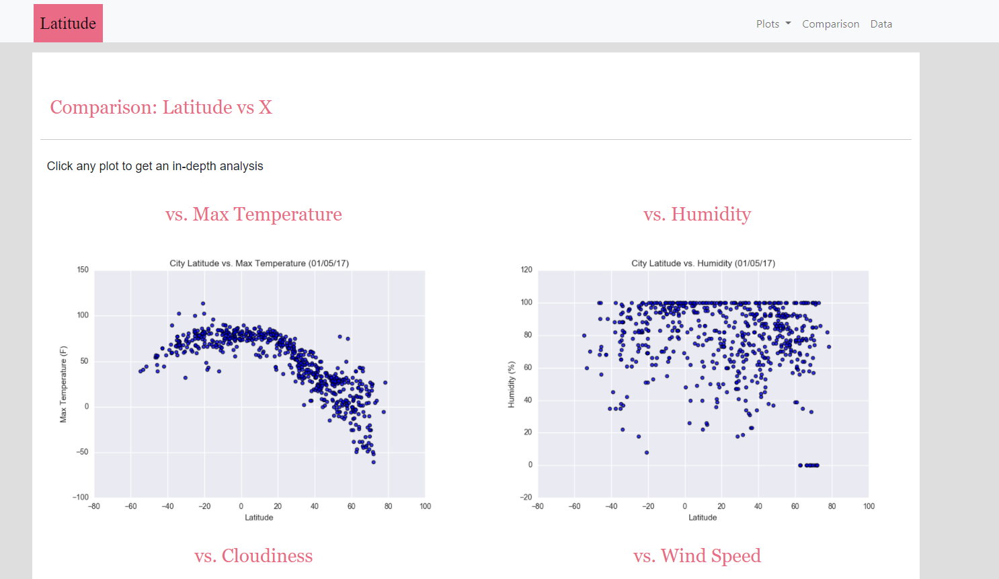
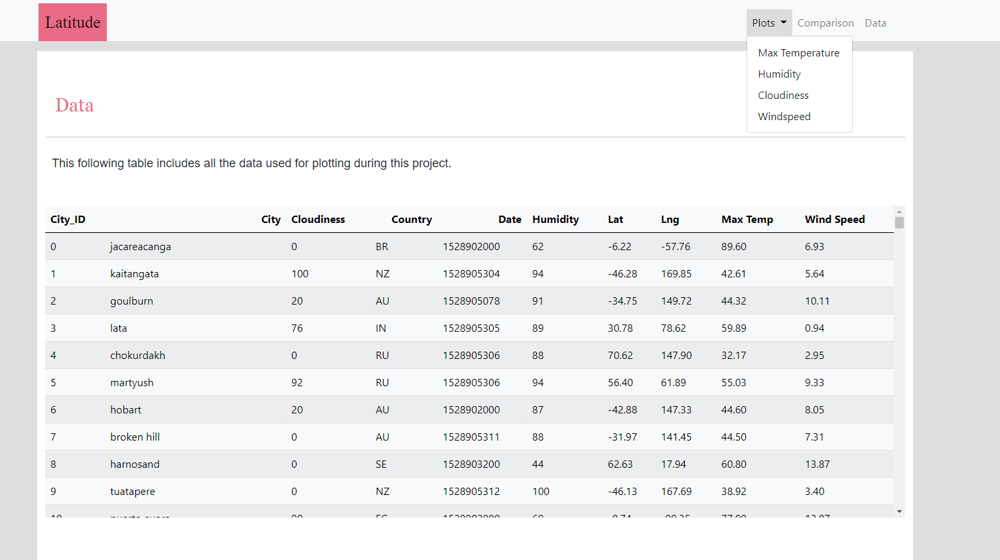

# Web Design: Web Visualization Dashboard (Latitude)

## Background

Data is more powerful when we share it with others! Let's take what we've learned about HTML and CSS to create a dashboard showing off the analysis we've done.

## Web Design

### The Landing Page:

 * An explanation of the project.
 * Links to each visualizations page. There should be a sidebar containing preview images of each plot, and clicking an image should take the user to that visualization.

### Four Visualizations Page:

 * A descriptive title and heading tag.
 * The plot/visualization itself for the selected comparison.
 * A paragraph describing the plot and its significance.

### The Comparison Page:

 * Contains all of the visualizations on the same page so we can easily visually compare them.
 * Uses a Bootstrap grid for the visualizations.
 * The grid must be two visualizations across on screens medium and larger, and 1 across on extra-small and small screens.

### The Data Page:

 * Displays a responsive table containing the data used in the visualizations.
 * The table must be a bootstrap table component. Hint
 * The data must come from exporting the .csv file as HTML, or converting it to HTML. Try using a tool you already know, pandas. Pandas has a nifty method approprately called to_html that allows you to generate a HTML table from a pandas dataframe.

